# Anleitung: Kompletter Workflow ohne KI, nur mit der R-Konsole

Diese Datei ist ein **Kochbuch**, kein Nachschlagewerk. Ziel: ein Mensch kann
jeden Schritt der Modellauswahl (`010`-`155`) manuell in der R-Konsole
nachvollziehen - Befehl eingeben, Ausgabe lesen, Entscheidung treffen, naechster
Befehl - ohne dass eine KI die Ergebnisse interpretiert. `TARGETS.md`
dokumentiert das *Werkzeug* `targets` (wie der Cache/Abhaengigkeitsgraph
funktioniert); `README_DETAILS.md` dokumentiert die *inhaltlichen Ergebnisse*
dieses konkreten Projekts. Diese Datei dokumentiert den *Ablauf*: was in welcher
Reihenfolge zu tun ist, welche Ausgabe was bedeutet, und an welchen Stellen ein
Mensch eine echte Entscheidung treffen muss (die kein Skript automatisch trifft).

Jeder Abschnitt entspricht einer Phase der `TARGETS.md`-Checkliste
"Uebertragung auf einen neuen Kaggle-Wettbewerb", aber ausführlicher: mit
Beispielbefehlen, erwarteten Ausgabeformen und Entscheidungsregeln.

## Workflow-Diagramm

Ueberblick ueber den kompletten Ablauf inkl. aller Entscheidungspunkte, die
kein Skript automatisch trifft. Rauten = Entscheidung, Rechtecke = Skript/
Schritt, Doppelrahmen = externes Playbook-Dokument, Kapseln = Start/Ende.
Details zu jeder Phase stehen unten im jeweiligen Abschnitt.

```mermaid
flowchart TD
    Start(["Neues Kaggle-Projekt"]) --> Prep["Phase 0: Kaggle-Overview lesen<br/>Zielspalte, Metrik-Wortlaut, Submission-Format"]
    Prep --> Config["Phase 1: 000_config.R ausfuellen<br/>id_col, target_col, baseline_measure_ids"]

    Config --> LeakAudit["015: Target-Leak-Audit<br/>(volles Dataset, kein Subset)"]
    LeakAudit --> DLeak{"Feature &gt;50% Gain-Share<br/>oder Determinismus:<br/>P(Klasse gegeben Wert) = 0 oder 1?"}
    DLeak -- "ja" --> LeakFix["Feature entfernen/pruefen<br/>(honest-vs-inflated Vergleich)"]
    LeakFix --> LeakAudit
    DLeak -- "nein" --> EDA["Phase 2: 010_eda.R<br/>Zeilen/Spalten, Klassenverteilung, Missing-Rate"]

    EDA --> DPanel{"Zeitreihe oder gruppierte<br/>Entitaeten (Panel-Daten)?"}
    DPanel -- "ja" --> GroupCV["Standard-Stratum-CV ersetzen<br/>durch Zeit- oder Group-Resampling"]
    DPanel -- "nein" --> Task["Phase 3: 020_task.R<br/>stratifizierter Task, subset_fraction"]
    GroupCV --> Task

    Task --> SplitSens["Phase 3b: 022_split_size_sensitivity.R<br/>rpart, rsmp(subsampling, repeats=20)"]
    SplitSens --> DSplitSkip{"Zeilenzahl &gt;<br/>split_sensitivity_max_n (5000)?"}
    DSplitSkip -- "ja, uebersprungen" --> LearnCurve
    DSplitSkip -- "nein" --> DSplitFlag{"CV bei validation_ratio<br/>&gt; 2x Minimum ueber alle ratios?"}
    DSplitFlag -- "nein" --> LearnCurve
    DSplitFlag -- "ja" --> SplitFix["Anderen ratio waehlen<br/>und/oder CV statt Holdout"]
    SplitFix --> LearnCurve

    LearnCurve["Phase 3c: 023_learning_curve.R<br/>Ranger, Score vs. Trainingsgroesse"]
    LearnCurve --> DLearnCurve{"Regressions-Steigung bei<br/>subset_fraction noch relevant<br/>(&gt;10% der Score-Spannweite)?"}
    DLearnCurve -- "nein, Plateau" --> Baseline
    DLearnCurve -- "ja, noch steigend" --> LearnCurveNote["Subset-basierte Modellvergleiche<br/>mit Vorsicht interpretieren<br/>(Ranking koennte bei mehr Daten kippen)"]
    LearnCurveNote --> Baseline

    Baseline["Phase 4: 030_baseline.R<br/>LDA / Multinom / Ranger per Holdout"]
    Baseline --> DCard{"Faktor-Spalte<br/>&gt;50 Auspraegungen?"}
    DCard -- "ja" --> CardFix["Fuer LDA/Multinom ausschliessen<br/>oder kodieren (sonst Absturz)"]
    DCard -- "nein" --> AdvVal
    CardFix --> AdvVal["Phase 5: 115_adversarial_validation.R<br/>Train vs. Test unterscheidbar?<br/>+ univariate Drift-Tests je Feature"]

    AdvVal --> DShift{"Adversarial-Validation-AUC?"}
    DShift -- "um 0.5" --> Calib
    DShift -- "0.6 bis 0.7" --> ShiftCare["Treiber-Spalten vorsichtig behandeln,<br/>CV-Entscheidungen kritischer pruefen"]
    DShift -- "0.9 oder mehr, strukturell" --> ShiftPlaybook[["docs/reference/REFERENZ_DISTRIBUTION_SHIFT.md<br/>gestufte Zerlegung, ESS-Gate,<br/>Invarianz statt Korrektur"]]
    ShiftCare --> Calib
    ShiftPlaybook --> Calib

    Calib["Phase 5b: Kalibrierung vormerken<br/>(nur falls LogLoss/Brier in Metrik)"] --> DFeat{"Baseline hat Spielraum<br/>UND konkrete Feature-Idee?"}

    DFeat -- "nein" --> Boosting
    DFeat -- "ja" --> FeatEng["Phase 6: 025 / 035-038<br/>Feature-Familie(n) bauen"]
    FeatEng --> DFamImp{"Familie verbessert<br/>Holdout spuerbar?"}
    DFamImp -- "nein" --> RawFeat["Rohfeatures behalten<br/>(negatives Ergebnis ist valide)"]
    DFamImp -- "ja" --> CVConfirm["037: 5-fache CV bestaetigt Auswahl"]
    CVConfirm --> SelFam["selected_families uebernehmen<br/>(000_config.R)"]
    RawFeat --> Boosting
    SelFam --> Boosting

    Boosting["Phase 7: 080 / 081<br/>Ranger/LightGBM nativ + XGBoost One-Hot via 040"] --> Tuning["Phase 8: 090 / 100 Tuning<br/>tnr(mbo), Budget &gt;= 4x Suchraum-Dimension"]

    Tuning --> DMbo{"diagnose_mbo_search():<br/>echte Verfeinerung UND<br/>unabhaengige CV-Gegenprobe besser?"}
    DMbo -- "nein" --> KeepDefault["Tuning verwerfen,<br/>Default-Hyperparameter behalten"]
    DMbo -- "ja" --> AdoptTuning["Getunte Hyperparameter uebernehmen"]

    KeepDefault --> SeedStab
    AdoptTuning --> SeedStab

    SeedStab["Phase 8b: 092_seed_stability.R<br/>Seed-Varianz + Hyperparameter-Jitter"]
    SeedStab --> DSeedStab{"Streuung &gt; 0.5x der<br/>normalen CV-Fold-Streuung?"}
    DSeedStab -- "nein" --> ClassWeight
    DSeedStab -- "ja" --> SeedStabFix["Mehr Baeume/Iterationen<br/>und/oder ueber Seeds mitteln<br/>(Ensemble Selection)"]
    SeedStabFix --> ClassWeight

    ClassWeight["Phase 9: 105 / 135<br/>class_weight_power-Gitter"]
    ClassWeight --> DMetric{"is_threshold_independent_metric()?"}
    DMetric -- "unabhaengig, AUC/LogLoss" --> SkipThresh["Klassengewichtung: niedrige Prioritaet.<br/>Phase 10 UEBERSPRINGEN"]
    DMetric -- "abhaengig, BAcc/MCC/Acc/F1" --> ThreshTune["Phase 10: 130 / 146<br/>Schwellenwert-Tuning, hohe Prioritaet"]

    SkipThresh --> ErrorAnalysis
    ThreshTune --> ErrorAnalysis["Phase 11: 147-Kette<br/>models, dann confidence, isolation_forest,<br/>kernelshap, tabpfn, segments"]

    ErrorAnalysis --> DRescue{"Modell B rettet auffaellig<br/>viele Fehler von Modell A?"}
    DRescue -- "ja, pruefen" --> Disagreement["check_disagreement_accuracy():<br/>P(B richtig, wenn A und B uneinig)"]
    Disagreement --> DCorrect{"Korrekturregel lohnt sich?"}
    DCorrect -- "nein" --> NoCorrect["War Mehrheitsklassen-Bias,<br/>keine Korrekturregel"]
    DCorrect -- "ja" --> UseCorrect["Korrektur-/Ensemble-Regel uebernehmen"]
    DRescue -- "nein" --> Boundary
    NoCorrect --> Boundary
    UseCorrect --> Boundary

    Boundary{"Modelluebergreifend identische,<br/>selbstsichere Fehler?"}
    Boundary -- "ja" --> StopTuning["Strukturelle Grenze:<br/>weiteres Tuning bringt wenig, stoppen"]
    Boundary -- "nein" --> NeuralGate
    StopTuning --> NeuralGate

    NeuralGate{"Optional, NEURAL_DEPLOY.md:<br/>GBMs zu korreliert, ca. 0.99,<br/>Blend bringt kaum mehr?"}
    NeuralGate -- "nein" --> SelectModel
    NeuralGate -- "ja" --> FTProto["FT-Transformer-Prototyp<br/>(mlr3torch, R/CPU, Sample)"]
    FTProto --> DDecorr{"Dekorreliert, ca. 0.9x,<br/>UND konkurrenzfaehig?"}
    DDecorr -- "nein" --> NoNeural["Kein neuronales Modell,<br/>GBM-Ensemble ist final"]
    DDecorr -- "ja" --> PyExport["Python-GPU-Export<br/>(Kaggle-Notebook, s6e8-Vorlage)"]
    NoNeural --> EnsembleSelection
    PyExport --> EnsembleSelection

    EnsembleSelection["Phase 11b: 148_ensemble_candidate_pool.R<br/>+ 149_ensemble_selection.R<br/>Caruana Greedy Ensemble Selection"] --> DEnsembleWins{"Greedy-Ensemble schlaegt<br/>bestes Einzelmodell (Bestaetigungsmenge)?"}
    DEnsembleWins -- "ja" --> EnsembleDeploy["Phase 12a-Alt: 156_train_full_ensemble.R<br/>+ 157_predict_ensemble_submission.R<br/>nur eindeutige Kandidaten, gewichtet gemittelt"]
    DEnsembleWins -- "nein" --> SelectModel
    EnsembleDeploy --> SubmissionDone2(["submission_ensemble.csv"])

    SelectModel["Phase 12a: 148_select_submission_model.R<br/>Vorschlag aus experiments.db"] --> FullTrain["Phase 12b: 150_train_full_model.R<br/>Training auf VOLLEM train.csv"]
    FullTrain --> Predict["Phase 12c: 155_predict_submission.R"]

    Predict --> DProb{"Wahrscheinlichkeits-Submission,<br/>AUC oder LogLoss?"}
    DProb -- "ja" --> ProbCol["Richtige Klassenspalte explizit waehlen,<br/>NICHT mlr3-Default positive class"]
    DProb -- "nein, Klassenlabel" --> SubmissionDone
    ProbCol --> SubmissionDone(["submission.csv"])
    SubmissionDone --> MergeDB["Projekt in zentrale experiments.db uebernehmen:<br/>Rscript merge_project_experiments.R<br/>(im Template, idempotent, separater Aufruf)"]
    MergeDB --> Done(["Ende"])
```



## Phase 0: Vorbereitung

**Zwei Projektarten** - die Schritte unten sind fuer einen Kaggle-Wettbewerb
geschrieben (echtes `test.csv` + Leaderboard-Bewertung). Fuer ein OpenML-
Standalone-Projekt (kein externer Testsatz, keine Leaderboard-Bestaetigung
moeglich - siehe TARGETS.md, "OpenML-Projekte haben keinen externen
Testsatz") gilt derselbe Ablauf mit drei Anpassungen: (a) Schritt 1 entfaellt
(kein `test.csv`/`sample_submission.csv` - ein eigenes `005_download_
openml.R` per `mlr3oml::odt(<exakte-ID>)` laedt `train.csv`, siehe
`ML_Learning/openml-credit-g/005_download_openml.R` als Vorlage; **exakte
ID/Name verwenden, `list_oml_data()`s Freitextsuche und die openml.org-
Weboberflaeche waren in dieser Session wiederholt unzuverlaessig**), (b)
Schritt 3 entfaellt (keine Wettbewerbsseite - `baseline_measure_ids`
bewusst auf die Template-Konvention `c("classif.bacc", "classif.mcc")`
setzen, da keine externe Metrik-Vorgabe existiert), (c) vor Schritt 4
`Rscript analysis/suggest_subset_fraction.R` ausfuehren (kleine OpenML-Datensaetze
brauchen oft `subset_fraction=1.0`, siehe TARGETS.md).

1. Projektordner mit `train.csv`, `test.csv`, `sample_submission.csv` von
   Kaggle anlegen (z.B. `C:/Users/HP/OneDrive/Dokumente/R_Workspace/<projekt>/`).
2. Alle nummerierten Skripte, `000_config.R`, `005_benchmark_runtime.R`,
   `006_tuning_diagnostics.R`, `class_multiplier_tuning.R`, `db_logging.R`,
   `db_schema.sql` aus diesem Template-Repo in den neuen Ordner kopieren
   (`006`/`class_multiplier_tuning.R` werden leicht uebersehen, da sie nur
   von `100`/`130` per `source()` nachgeladen werden, nicht offensichtlich
   als eigene Abhaengigkeit - Reibungspunkt, der dieser Session mehrfach
   auffiel, siehe TARGETS.md). `features/utils.R`
   (nur `safe_divide()`) ebenfalls kopieren, `features/*.R` sonst leer lassen.
3. **Kaggle-Wettbewerbsseite lesen** (Overview + Data), BEVOR `000_config.R`
   ausgefuellt wird: Zielspalte, Bewertungsmetrik (steht im Abschnitt
   "Evaluation" der Overview-Seite, Wortlaut genau lesen - z.B. "area under
   the ROC curve" = AUC, nicht automatisch BAcc/Accuracy annehmen), erwartetes
   Submission-Format (Wahrscheinlichkeit oder Klassenlabel?).
4. `000_config.R` ausfuellen (siehe Phase 1).
5. Windows/R-spezifisch (siehe `project_r_windows_env`-Hinweise, gelten fuer
   jedes Projekt):
   - `Rscript` ist meist nicht im PATH - vollen Pfad verwenden, z.B.
     `C:\Users\HP\Programme\R\R-4.5.2\bin\Rscript.exe skriptname.R`.
   - **Nie mehrzeiligen R-Code direkt per `-e` an ein Terminal uebergeben** -
     das fuehrt zu Segfaults/falscher Shell-Interpolation. Immer zuerst in
     eine `.R`-Datei schreiben, dann `Rscript.exe datei.R` ausfuehren.
   - Wird ein Skript ausgefuehrt, das (noch) gar nicht existiert (z.B. beim
     Kopieren vergessen), kann `Rscript.exe` unter Windows/Git-Bash statt
     einer klaren "file not found"-Fehlermeldung einen **Segmentation
     fault** werfen. Bei einem Segfault direkt nach dem Kopieren der Skripte
     zuerst pruefen, ob die Datei tatsaechlich am erwarteten Pfad liegt
     (`ls`/`Get-ChildItem`), bevor man tiefer im Code sucht.
   - Rechenintensive Skripte im Hintergrund starten und Fortschritt per
     Log-Datei pruefen, nicht die Konsole blockieren.

## Phase 1: `000_config.R` ausfuellen

Pflichtfelder (siehe `TARGETS.md`-Checkliste Punkt 2):

| Variable | Bedeutung | Beispiel |
|---|---|---|
| `id_col` | Name der ID-Spalte | `"id"` |
| `target_col` | Name der Zielspalte | `"diagnosed_diabetes"` |
| `project_name` | Label fuer `experiments.db` | `"playground-series-s5e12-diabetes"` |
| `baseline_measure_ids` | Zielmetrik zuerst, Diagnose-Metrik danach | `c("classif.auc", "classif.bacc")` |

Alles andere (`task_id_prefix`, Pfade unter `artifact_dir`, `resolve_task_path()`,
`resolve_submission_model_name()`, `add_balanced_class_weights()`,
`feature_set_from_task_id()`, `algorithm_from_learner_id()`) laesst sich
unveraendert aus diesem Template kopieren - das sind generische Helfer, keine
projektspezifischen Werte.

**Zwei Entscheidungen, die die Checkliste leicht uebersieht:**

- **`error_analysis_uncertainty_threshold`**: bei genau 2 Zielklassen ist die
  Konfidenz der vorhergesagten Klasse mathematisch immer >= 0.5 (beide
  Klassenwahrscheinlichkeiten summieren zu 1). Ein Schwellenwert von 0.5 waere
  dort entartet (der "unsicher"-Eimer bleibt leer) - bei binaeren Aufgaben
  bewusst hoeher setzen, z.B. `0.7`. Bei >=3 Klassen ist `0.5` dagegen sinnvoll.
- **`class_weight_power`**: als Startwert `0` (ungewichtet) setzen, nicht
  raten. Der tatsaechlich sinnvolle Wert ist ein **Ergebnis** von Phase 9
  (Klassengewichtung pruefen), keine Config-Eingabe im Voraus.
- **`subset_fraction`**: NICHT blind beim Template-Default `0.10` belassen -
  bei kleinen Datensaetzen ergibt ein fester Prozentsatz zu wenige absolute
  Zeilen (steel-plates-fault: 1941*0.10 = 194 Zeilen, musste auf `1.0`
  korrigiert werden). Vorschlag per `Rscript analysis/suggest_subset_fraction.R` im
  Projektordner (liest `train.csv`, schlaegt einen Anteil vor, der eine
  Mindestzeilenzahl sicherstellt) - Faustregel, kein statistisch
  verifizierter Wert wie bei den Diagnose-Modulen, siehe dessen
  Kopfkommentar.

`feature_families`/`selected_families` zunaechst `character(0)` lassen, falls
noch kein Feature Engineering feststeht (siehe Phase 6).

## Phase 2: EDA (`010_eda.R`)

```r
setwd("<projektordner>")
source("010_eda.R")
```

Worauf achten:

- **Zeilen-/Spaltenzahlen** (Train voll/10%-Subset/Test) - Plausibilitaetscheck.
- **Klassenverteilung der Zielvariable** (`count()`-Ausgabe): grobes
  Ungleichgewicht (z.B. 80/20) beeinflusst spaeter, ob Klassengewichtung
  wichtig wird (Phase 9).
- **`skimr`-Summary**: `n_missing`/`complete_rate` je Spalte (fehlende Werte?
  die Imputations-Pipeline in `030`/`070`/etc. faengt das zwar automatisch
  ab, aber ein sehr hoher Anteil fehlender Werte in einer wichtigen Spalte ist
  trotzdem eine Entscheidung wert), `n_unique` bei character-Spalten
  (hochkardinale Spalten vormerken, siehe Phase 4 Warnung).

Keine automatisierte Entscheidung hier - reine Bestandsaufnahme.

## Phase 3: Rohfeature-Task bauen (`020_task.R`)

```r
source("020_task.R")
```

Zieht ein `subset_fraction`-Sample (stratifiziert nach Zielklasse), wandelt
character-Spalten in Faktoren um, speichert den `mlr3`-`TaskClassif` unter
`task_train_small_path`. Ausgabe zeigt Feature-Typen (`int`/`fct`/`dbl`) und
bei binaeren Aufgaben, welche Klasse `mlr3` als "positive class" waehlt
(alphabetisch erste Faktorstufe, z.B. `"0"` vor `"1"`) - das betrifft NUR die
interne Zaehlrichtung von Sensitivitaet/Spezifitaet bei Diagnose-Ausgaben.
AUC und BAcc sind symmetrisch bezueglich der Wahl der positiven Klasse (siehe
Phase 12, dort ist die Wahl der richtigen Wahrscheinlichkeitsspalte fuer die
Kaggle-Submission dagegen entscheidend).

Der Task markiert die Zielspalte zudem als `stratum`. Damit erhalten alle
klassifikationsbasierten Holdout- und CV-Resamplings im Workflow die
Klassenanteile. Fuer Zeitreihen oder gruppierte Daten muss dieser Standard vor
der Ausfuehrung durch ein passendes Zeit- bzw. Group-Resampling ersetzt werden.

## Phase 3b: Split-Size-Sensitivity-Analyse (`022_split_size_sensitivity.R`)

```r
source("022_split_size_sensitivity.R")
```

Prueft, ob der gewaehlte `validation_ratio` selbst stabil ist - BEVOR man
einer einzelnen Holdout-Bewertung in den folgenden Phasen vertraut.
Wiederholt den Split 20-mal je getestetem Anteil (`rsmp("subsampling")`,
`classif.rpart` als guenstiger Test-Lerner) und vergleicht die Streuung
(Variationskoeffizient) beim gewaehlten Anteil gegen das Minimum ueber alle
getesteten Anteile. Wird bei Datensaetzen ueber `split_sensitivity_max_n`
(Default 5000 Zeilen) automatisch uebersprungen - der Aufwand lohnt sich
nur bei kleineren Datensaetzen, siehe TARGETS.md fuer die Herleitung.

Meldet das Skript "AUFFAELLIG" (Streuung beim gewaehlten Anteil > 2x das
Minimum): entweder den in der Ausgabe genannten stabileren Anteil
uebernehmen, oder generell auf CV-/Repeated-CV-basierte statt einzelner
Holdout-Bewertung umstellen fuer die restlichen Phasen dieses Projekts
(siehe Kopfkommentar in `split_size_sensitivity.R` fuer die volle
Reaktions-Anleitung).

## Phase 3c: Lernkurve (`023_learning_curve.R`)

```r
source("023_learning_curve.R")
```

Prueft, ob `subset_fraction` selbst gut kalibriert ist - steigt der Score
bei mehr Trainingsdaten noch spuerbar? ANDERS als Phase 3b (dort war der
Mechanismus weitgehend lernverfahren-unabhaengig, `rpart` als billiger
Stellvertreter genuegte) haengt das Ergebnis hier direkt von der Kapazitaet
des Algorithmus ab - das Skript laeuft deshalb mit Ranger, dem tatsaechlich
eingesetzten Algorithmus, nicht mit einem billigen Ersatz.

Laedt bewusst den VOLLEN Datensatz (nicht `task_train_small`), um auch
ueber den bisherigen `subset_fraction`-Punkt hinaus testen zu koennen -
gekappt bei `learning_curve_max_rows` (Default 150000 Zeilen), da der
Aufwand hier - anders als bei Phase 3b - genau dort liegt, wo die
Information am interessantesten ist (nahe der vollen Datenmenge), und sich
deshalb nicht einfach bei grossen Datensaetzen umgehen laesst.

Meldet das Skript "NOCH STEIGEND" (Regressions-Steigung bei `subset_fraction`
noch relevant): kein Grund zum Abbruch, aber Modellvergleiche/Hyperparameter-
Entscheidungen aus den folgenden Phasen sollten mit dem Vorbehalt gelesen
werden, dass sich die Rangfolge zwischen Algorithmen bei mehr Trainingsdaten
theoretisch noch verschieben koennte (das finale Modell trainiert ohnehin
auf 100%, Phase 12b - die Warnung betrifft nur die AUSWAHL-Entscheidungen
davor).

## Phase 4: Baselines (`030_baseline.R`)

```r
source("030_baseline.R")
```

Trainiert LDA, Multinom, Ranger (jeweils mit `imputemedian`/`imputemode`-
Vorverarbeitung) per Holdout, misst `baseline_measure_ids`.

**Zwei Fallstricke, auf die die Skripte selbst hinweisen (nicht raten,
Warnungen lesen):**

1. **`warn_high_cardinality_factors()`** (aus `005_benchmark_runtime.R`) warnt,
   wenn eine Faktor-Spalte > 50 Auspraegungen hat. LDA/Multinom kodieren
   Faktoren implizit als One-Hot - bei sehr vielen Auspraegungen kann das zu
   Spalten fuehren, die innerhalb einer Zielklasse konstant sind, was `lda`/
   `multinom` zum Abstuerzen bringt. Bei einer Warnung: Spalte fuer diese
   Modelle ausschliessen (z.B. in `020_task.R`) oder sinnvoll kodieren
   (Frequenz-/Zielkodierung, spaeter als Feature Engineering).
2. **`baseline_measure_ids` enthaelt eine schwellenwertunabhaengige Metrik
   wie `classif.auc`?** Dafuer braucht jeder Learner `predict_type = "prob"`,
   nicht nur eine Klassenvorhersage (`response`). `030_baseline.R`,
   `080_boosting_benchmark.R`, `090_ranger_tuning.R`, `100_lightgbm_tuning.R`
   und `105_lightgbm_class_weights.R` setzen das bereits standardmaessig (seit
   2026-07-14) - kostet fuer `classif.bacc`/`classif.mcc` nichts, macht die
   Skripte aber sofort AUC-/LogLoss-tauglich. Ebenso optimieren `090`/`100`
   bereits `baseline_measure_ids[1]` statt hart codiertem `classif.bacc` beim
   Tuning. **Trotzdem pruefen** bei eigenen/weiteren Skripten mit `lrn(...)`-
   Aufrufen (`110`, `120`, `125`, `140`, `142`, `145` usw.) - dieser Punkt trat
   vor der Behebung zweimal unabhaengig auf (`playground-series-s6e5`,
   `playground-series-s5e12`), das Muster kann sich bei neuen/eigenen
   Skripten wiederholen.

Ergebnis interpretieren: `baseline_results.csv`/Konsolen-Tabelle zeigt
`classif.auc`/`classif.bacc` je Learner. Liegen alle drei nah beieinander
(z.B. AUC ~0.69-0.70 fuer alle), ist das ein erstes Signal, dass simple
lineare Trennbarkeit an einer Grenze angekommen ist - noch keine
abschliessende Aussage, aber ein Hinweis, spaeter (Phase 11) nach
modelluebergreifend identischen Fehlern zu suchen.

## Phase 5: Adversarial Validation (`115_adversarial_validation.R`)

```r
source("115_adversarial_validation.R")
```

Trainiert einen LightGBM-Klassifikator, der Train- von Test-Zeilen unterscheiden
soll (Zielspalte entfernt, neue Binaerspalte `is_test`). Interpretation:

- **AUC nahe 0.5**: Train und Test aehnlich verteilt. CV-Ergebnisse aus den
  folgenden Phasen sollten sich auf das Leaderboard uebertragen - normal
  weitermachen.
- **AUC deutlich > 0.5** (z.B. > 0.6-0.7): Distribution Shift. Die
  Feature-Importance-Tabelle zeigt, welche Spalten den Unterschied treiben -
  diese Spalten mit Vorsicht behandeln (ggf. ausschliessen oder robuster
  kodieren), CV-basierte Entscheidungen in spaeteren Phasen kritischer pruefen.

**Univariate Drift-Tests (`univariate_drift.R`, direkt im Anschluss)**:
Ergaenzt die Adversarial-AUC um einen KS-Test (stetige Features) bzw.
Chi-Quadrat-Test (kategoriale Features) je Spalte, mit Benjamini-Hochberg-
Korrektur ueber alle Features. Sagt WELCHE Features driften (mit
Effektgroesse D bzw. Cramers V), waehrend die Adversarial-AUC nur "insgesamt
trennbar ja/nein/wie stark" sagt - im Sensitivitaetstest (siehe `TARGETS.md`)
trennte die AUC nicht zwischen echtem Markt-Drift und stabiler Kalender-
struktur, die univariaten Tests taten es. Wichtig: p-Wert und Effektgroesse
zusammen lesen, nicht nur den p-Wert - bei grossen Datensaetzen wird sonst
auch eine praktisch irrelevante Abweichung "signifikant" (im Template-eigenen
Projekt z.B. `gender` mit p_adj_BH ~1e-297, aber Cramers V nur 0.037).

**Bei hartem oder strukturellem Shift** (AUC ~0.9+, oder wenn die Feature-
Importance nicht auf einzelne Spalten reduzierbar ist) reicht die reine
Importance-Betrachtung nicht - dann dem Playbook `docs/reference/REFERENZ_DISTRIBUTION_SHIFT.md`
folgen: gestufte Shift-Zerlegung (roh -> missing-robuste Aggregate -> gleiche
Achse), ESS-Gate vor Importance-Weighting, Invarianz statt Korrektur, und - der
zentrale Punkt - die CV kann Shift-Robustheit NICHT bewerten, die Feature-Set-
Wahl gehoert dann auf ein shift-exponiertes Set (Leaderboard/Holdout).

Diese Phase bewusst VOR Feature Engineering/Tuning einordnen - ein Shift
wuerde sonst alle nachfolgenden CV-Vergleiche unbemerkt verzerren.

## Phase 5b: Probability-Kalibrierung vormerken

Wenn die Wettbewerbsmetrik LogLoss/Brier oder eine Multi-Metric-Kombination mit
LogLoss enthaelt, ist Kalibrierung ein spaeterer sauberer Hebel. Nicht vor den
Baselines anwenden, aber frueh vormerken:

- Alle relevanten Learner mit `predict_type = "prob"` trainieren.
- Neben AUC auch LogLoss/Brier und mittlere vorhergesagte Wahrscheinlichkeit
  tracken.
- Nach Modell-/Feature-Auswahl OOF-Vorhersagen erzeugen und eine monotone
  Kalibrierung testen.

Fuer Details siehe `docs/reference/REFERENZ_PROBABILITY_CALIBRATION.md`. Wichtigster Punkt:
Kalibrierung nie auf denselben Zeilen bewerten, auf denen sie gefittet wurde.
Platt-Kalibrierung ist:

```text
p_cal = sigmoid(a + b * logit(p_raw))
```

Dabei sind `logit` und `sigmoid` Umkehrfunktionen, nicht dasselbe.

Fairness-Regel fuer Wettbewerbe: Wenn ein lokal/OOF validierter Kalibrierungs-
oder Ensemble-Kandidat einmal auf dem Leaderboard bestaetigt wurde, nicht weiter
mit sehr aehnlichen Nachbarvarianten nachlegen. Weitere Submissions brauchen eine
neue methodische Idee; reine Mikrovarianten wie minimale Regularisierungswerte,
Clipping-Schwellen oder Temperaturwerte sind sonst schnell Leaderboard-Fitting.

## Phase 6: Feature Engineering (optional, `025`/`035`-`038`)

Nur durchfuehren, wenn Phase 4 (Baselines) noch klar unterhalb einer
plausiblen Obergrenze liegt (z.B. deutlich unter 1.0 AUC/BAcc, mit Rest-
Spielraum) UND konkrete inhaltliche Ideen fuer neue Merkmale vorhanden sind
(reines Ausprobieren ohne Hypothese bringt selten etwas).

0. **Vor dem Schreiben pruefen**: sind die geplanten Features reine
   Linearkombinationen/Verhaeltnisse aus bereits vorhandenen numerischen
   Rohspalten (z.B. `a - b`, `a / b`, gewichtete Summen)? Baum-/Boosting-
   Modelle koennen solche Beziehungen ueber Splits meist selbst approximieren
   (kein Informationsgewinn), fuer lineare Modelle (LDA/Multinom) drohen sogar
   Kollinearitaetsprobleme. Bei `playground-series-s5e12` verschlechterten
   genau solche Features (Cholesterin-/Blutdruck-Verhaeltnisse) die Zielmetrik
   konsistent ueber vier Modelle, mit expliziten `lda.default`-
   Kollinearitaetswarnungen. Aussichtsreicher sind Features, die echte NEUE
   Information codieren, die in den Rohspalten nicht linear enthalten ist
   (Cross-Row-Aggregationen, domaenenspezifische nichtlineare Kategorien).
1. Neue Datei(en) `features/<familie>.R` mit `add_<familie>_features(data)`
   schreiben (Signatur: Data-Frame rein, Data-Frame mit zusaetzlichen Spalten
   raus, `%>%`/`mutate()`-Stil wie die bestehenden Beispiele).
2. `feature_families` in `000_config.R` um die neuen Namen ergaenzen.
3. `025_feature_engineering.R` ausfuehren - baut je Familie einen eigenen
   Task plus einen kombinierten Task.
4. `035_feature_baseline.R`/`036_feature_family_benchmark.R` ausfuehren -
   vergleicht Roh-Task gegen jede Familie einzeln und kombiniert (Holdout).
5. **Entscheidungsregel**: nur Familien in `selected_families` uebernehmen,
   die den Holdout-Wert der Zielmetrik spuerbar verbessern (nicht nur im
   Rauschen). `037_selected_features_cv.R` bestaetigt die Auswahl per 5-facher
   CV, bevor sie in `model_feature_sets` (`000_config.R`) uebernommen wird.
   Verbessert **keine** Familie den Holdout-Wert (moeglich, siehe Schritt 0) -
   `037` ueberspringen (nichts zu bestaetigen), `selected_families` leer
   lassen und bei Rohfeatures bleiben. Ein negatives Ergebnis ist ein
   valides Ergebnis, keine gescheiterte Analyse.

`038_surrogate_guided_features.R` ist ein Sonderfall fuer automatisch
entdeckte Interaktionsfeatures (rpart-Ensemble als Scout) - nur relevant, wenn
manuelle Feature-Ideen ausgehen; siehe Kopfkommentar der Datei.

## Phase 7: Boosting-Vergleich (`080`/`081`, XGBoost braucht `040`)

```r
source("080_boosting_benchmark.R")   # Ranger + LightGBM per CV (kein One-Hot)
source("081_xgboost_benchmark.R")    # XGBoost per CV (braucht 040 One-Hot)
```

Der Vergleich ist bewusst auf zwei Skripte aufgeteilt: `080` deckt Ranger und
LightGBM ab, die Faktoren nativ verarbeiten und KEINE Preprocessing-Pipeline
brauchen. `081` deckt XGBoost ab, das als einziges eine One-Hot-Pipeline aus
`040_preprocessing.R` braucht (`classif.xgboost` akzeptiert nur logical/integer/
numeric, keine rohen Faktoren). So laesst sich der guenstige Ranger/LightGBM-
Vergleich (`080`) laufen, ohne die XGBoost-Preprocessing-Abhaengigkeit
mitzuziehen - `081` ist optional/nachgelagert. Vor dem Start die Laufzeit grob
abschaetzen (naechster Absatz).

**Laufzeit vorab schaetzen**: `estimate_cv_runtime()` (`db_logging.R`) liest
bereits geloggte Holdout-Laufzeiten aus `experiments.db` und multipliziert mit
der Fold-Zahl - hilfreiche Faustregel, um vor einem mehrminuetigen CV-Lauf zu
wissen, ob man warten oder im Hintergrund starten sollte.

## Phase 8: Tuning (`090`/`100`)

```r
source("100_lightgbm_tuning.R")   # oder 090_ranger_tuning.R
```

Nutzt `tnr("mbo")` (Bayesian Optimization via `mlr3mbo`). **Wichtige Falle**:
das Initialdesign skaliert mit ~4x der Anzahl Suchraum-Parameter. Ist das
Eval-Budget (`lightgbm_tuning_evals`/`ranger_tuning_evals`) kleiner als
Initialdesign + ~10-20, findet KEINE echte sequenzielle Verfeinerung statt -
alle Punkte laufen im selben `batch_nr`, das Ergebnis ist reines
(quasi-)Zufalls-Sampling, sieht aber oberflaechlich wie ein normaler
Tuning-Lauf aus.

`diagnose_mbo_search()` (`006_tuning_diagnostics.R`) wird nach jedem
`tnr("mbo")`-Lauf automatisch aufgerufen und meldet:

1. Ob mehr als ein `batch_nr` vorkommt (echte Verfeinerung ja/nein).
2. Ob das Budget die 4x-Dimensionen-Faustregel erfuellt.
3. Spannweite/R² der Zielmetrik ueber alle Archiv-Punkte (Plateau-Indikator).

**Entscheidungsregel**: Ergebnis eines Tuning-Laufs nur uebernehmen, wenn (1)
echte Verfeinerung stattfand UND (2) eine unabhaengige CV-Gegenprobe (nicht
nur der Tuning-Holdout-Split selbst) die Verbesserung bestaetigt. Ein
Tuning-Ergebnis, das nur auf dem Such-Holdout besser ist, aber in der
CV-Gegenprobe schlechter als der Default abschneidet, wurde ueberangepasst -
verwerfen, nicht uebernehmen.

## Phase 8b: Seed-/Hyperparameter-Rausch-Stabilitaet (`092_seed_stability.R`)

```r
source("092_seed_stability.R")
```

Prueft, wie sehr der Score bei FIXEN Daten (fester Train/Test-Split) allein
durch den Lerner-Seed bzw. leichtes Jitter auf den in Phase 8 gefundenen
Hyperparametern schwankt - ein anderer Rauschkanal als Phase 3b (Daten-
Sampling) oder die Feature-Rausch-Perturbation in `sanity_checks.R`.
Referenzpunkt: die normale CV-Fold-Streuung (mischt Daten- UND
Modellrauschen, deshalb strukturell fast immer groesser als reines
Modellrauschen allein - Parität als Schwelle waere zu streng, siehe
`seed_stability.R`-Kopfkommentar).

Braucht `ranger_tuning_instance_path` aus Phase 8 fuer den Jitter-Test (der
Seed-Test allein laeuft auch ohne Phase 8). Meldet das Skript "AUFFAELLIG"
(Streuung > 0.5x der CV-Referenz): mehr Baeume/Iterationen (Modell-Varianz
senken) und/oder ueber mehrere Seeds mitteln erwaegen - Letzteres nutzt die
Ensemble Selection (Phase 11b) bereits.

## Phase 9: Klassengewichtung pruefen (`105`/`135`)

```r
source("105_lightgbm_class_weights.R")
```

Testet `class_weight_power` ueber ein Gitter (typ. 0 bis 1, `135` erweitert
bis 3). **Bevor die Ergebnisse interpretiert werden**: pruefen, ob die
Zielmetrik schwellenwertunabhaengig ist.

```r
is_threshold_independent_metric(baseline_measure_ids[1])
```

- **Schwellenwertunabhaengig** (AUC, LogLoss): Klassengewichtung veraendert
  zwar die Verlustfunktion beim Training und kann daher einen echten (meist
  kleinen) Effekt haben, ist aber nachrangig. Post-hoc Schwellenwert-Tuning
  (Phase 10) ist dagegen komplett irrelevant - AUC integriert ueber alle
  Schwellenwerte, eine reine Cutoff-Verschiebung aendert an bereits
  berechneten Wahrscheinlichkeiten nichts an der Rangfolge.
- **Schwellenwertabhaengig** (BAcc, MCC, Accuracy, F1): beide Hebel
  (Klassengewichtung UND Schwellenwert-Tuning) koennen stark wirken - hohe
  Prioritaet.

`warn_if_threshold_step_low_value()` gibt genau diese Einschaetzung
automatisch aus, sobald `class_weight_power`-Ergebnisse geloggt sind - nicht
nur raten, Ausgabe lesen.

**Entscheidung**: den `power`-Wert mit dem besten Kompromiss aus Zielmetrik
und Diagnose-Metrik (z.B. BAcc vs. MCC) in `class_weight_power` sowie
`model_class_weight_power` (fuer die konkret gewinnenden Modelle) uebernehmen.

## Phase 10: Schwellenwert-Tuning (`130`/`146`, oft ueberspringbar)

Nur relevant, wenn Phase 9 eine schwellenwertabhaengige Zielmetrik ergeben
hat UND am Ende eine harte Klassenentscheidung (nicht nur eine
Wahrscheinlichkeit) gebraucht wird. Fuer AUC-/LogLoss-bewertete Wettbewerbe
i.d.R. ueberspringen (siehe Phase 9).

## Phase 11: Fehleranalyse (`147`)

Sechs lose gekoppelte Skripte statt eines Monolithen - jedes laedt das
Ergebnis des vorherigen als `.rds`-Artefakt, statt selbst neu zu trainieren.
Das hat sich als wichtig erwiesen: eine kleine Aenderung am DB-Logging
(letzter Schritt) erforderte vorher, KernelSHAP und TabPFN (die teuersten
Teile, teils >1h) jedes Mal neu laufen zu lassen, nur um sie zu testen.

```r
source("147_error_analysis_ranger_models.R")           # trainiert einmal, loggt vollstaendig
source("147_error_analysis_ranger_confidence.R")        # Rescue-Rate, "einig falsch"-Faelle
source("147_error_analysis_ranger_isolation_forest.R")  # Ausreissercheck
source("147_error_analysis_ranger_kernelshap.R")        # welche Features treiben Fehler?
source("147_error_analysis_ranger_tabpfn.R")            # komplett andere Methodik
source("147_error_analysis_ranger_segments.R")          # Slice-Based Evaluation, siehe unten
source("147_error_analysis_ranger_sanity_checks.R")     # Perturbation/Invarianz/Directional, siehe unten
source("148_ensemble_candidate_pool.R")                 # Kandidaten-Pool, siehe unten
source("149_ensemble_selection.R")                      # Greedy-Ensemble-Selection, siehe unten
```

**Segmentmetriken (`_segments.R`, optional, per `segment_metric_cols` in
`000_config.R` aktiviert)**: eine Gesamt-Metrik kann eine schwache
Untergruppen-Performance verstecken (Simpson-Paradoxon) - berechnet BAcc/MCC
je konfigurierter Segment-Spalte fuer alle drei Vergleichsmodelle und warnt
bei einer BAcc-Luecke ueber `segment_metric_warn_gap` (Default 0.05) zum
Segment-Mittel. Segmentspalten muessen unter den Modell-Features liegen
(Teil von `eval_imputed` im `_models.R`-Artefakt). An 2 OpenML-Datensaetzen
mit bekanntem Ground Truth verifiziert (echte, feature-gekoppelte Label-
Qualitaetsunterschiede korrekt erkannt, reiner Zufalls-Kontroll-Split korrekt
still), siehe `TARGETS.md`. Analoges Muster existiert im Regressions-
Template als `125_segment_metrics.R`.

**Sanity-Checks (`_sanity_checks.R`, optional, per `perturbation_test_cols`/
`invariance_test_cols`/`directional_expectation_specs` in `000_config.R`
aktiviert, siehe `sanity_checks.R`)**: drei Modell-Sanity-Checks nach Huyen
(2022) Kap. 6 - Perturbation (Rauschen auf numerische Features, Metrik-
Drop), Invarianz (Spalte mischen, die kausal irrelevant sein sollte,
Flip-Rate) und Directional Expectation (Feature in bekannter monotoner
Domainrichtung verschieben, Verletzungsrate der erwarteten Vorhersage-
Richtung). Reine Trust-/Sanity-Checks, kein Metrik-Hebel. An synthetischer
Ground Truth (bewusst kaputte vs. saubere Modelle) UND 2 realen Projekten
(health_condition, drivendata-pump-it-up) verifiziert: Perturbation/
Invarianz blieben auf beiden unauffaellig, Directional Expectation fand auf
beiden dasselbe Muster - Richtung im Aggregat korrekt, aber 3-5% aller
Zeilen mit einer substanziellen (>0.05) Gegenrichtungs-Verletzung, plausibel
durch Feature-Interaktionen im Tree-Ensemble (keine erzwungene globale
Monotonie). Siehe `TARGETS.md` fuer die vollen Zahlen, `REFERENZ_MODEL_
SANITY_CHECKS.md` fuer den theoretischen Hintergrund je Test.

**Ensemble Selection (`148_ensemble_candidate_pool.R` + `149_ensemble_
selection.R`)**: Caruana-Greedy-Ensemble-Selection (Caruana et al. 2004, wie
in Auto-sklearn) statt Einzelmodell-Wahl (`148_select_submission_model.R`)
oder festem Gleichgewichts-Blend. `_candidate_pool.R` trainiert einen Pool
aus 24 Kandidaten (8 Ranger/8 LightGBM/8 CatBoost, variierte Hyperparameter)
auf dem `_models.R`-Split und speichert deren Wahrscheinlichkeits-Matrizen
auf dem Eval-Split. `_selection.R` splittet diesen Eval-Split weiter in
Selektions-/Bestaetigungsmenge (klassenstratifiziert) und waehlt gierig
Modelle mit Wiederholung aus (Selektions-BAcc-Optimierung), bewertet aber
auf der unberuehrten Bestaetigungsmenge. An 2 unabhaengigen OpenML-
Datensaetzen verifiziert (bank-marketing/electricity, Standalone-Skripte),
gegen health_condition regressionsgetestet: Greedy-Ensemble > bestes
Einzelmodell > gleichgewichteter Blend, siehe `TARGETS.md` fuer die vollen
Zahlen, `docs/reference/REFERENZ_ENSEMBLE_SELECTION.md` fuer den theoretischen Hintergrund.

**Ensemble Deploy (`156_train_full_ensemble.R` + `157_predict_ensemble_
submission.R`)**: schliesst den Loop, wenn Greedy gewinnt. `_train_full_
ensemble.R` liest die in `149` gespeicherten eindeutigen Kandidaten+Gewichte
(`ensemble_composition_path`) und trainiert NUR diese (nicht jede
Wiederholung einzeln) auf dem vollen `train.csv` - deutlich teurer als die
Pool-Suche (55k-Stichprobe): bei health_condition 127 Minuten fuer 3
Ranger-Modelle auf 690k Zeilen, vorab zu niedrig geschaetzt. `_predict_
ensemble_submission.R` mittelt die Testvorhersagen aller Mitglieder
GEWICHTET (Gewicht = Selektionshaeufigkeit aus `149`) und schreibt
`submission_ensemble.csv` - **nicht** `submission.csv`, die bestehende
Einzelmodell-Submission bleibt unangetastet. End-to-end gegen
health_condition verifiziert: Zeilenzahl korrekt, 94% Uebereinstimmung mit
der Einzelmodell-Submission (sinnvoll unterschiedlich).

`_models.R` speichert Modelle+Vorhersagen unter `error_analysis_models_path`,
`_confidence.R` baut darauf auf und speichert abgeleitete Zeilen-Indizes
(misclassified/hard_case/...) unter `error_analysis_indices_path` - die
letzten drei Skripte laden beide Artefakte und lassen sich dadurch **einzeln
und in beliebiger Reihenfolge** neu ausfuehren, ohne die anderen anzufassen.

Das Muster (`_ranger`) ist auf das hier gewinnende Modell (Ranger)
zugeschnitten. Gewinnt in einem neuen Projekt ein anderes Modell (z.B.
LightGBM, siehe Phase 4/7), die Skripte entsprechend umbenennen/anpassen
(Primaermodell austauschen, Vergleichsmodelle bleiben strukturell andere
Modellfamilien) - Vorlage dafuer ist die schlankere Variante mit nur drei
Skripten (`_models`/`_confidence`/`_isolation_forest`, ohne KernelSHAP/
TabPFN), sinnvoll, solange noch kein Feature Engineering betrieben wird.

**KernelSHAP kann ueberraschend lange dauern** (mehr als eine Stunde, je nach
Klassenzahl/Stichprobengroesse `error_analysis_shap_sample_size`/
`_background_size` in `000_config.R`) - vor einem produktiven Lauf mit einer
kleinen Stichprobe (z.B. 15/15) testen, dass das Skript selbst korrekt
durchlaeuft, dann erst mit der vollen Groesse (im Hintergrund) starten.

Analysiert falsch klassifizierte/unsichere Zeilen des besten Modells:
Konfidenz-Verteilung, Vergleich mit anderen Modellfamilien (stimmen sie bei
denselben Zeilen ueberein?), Isolation-Forest-Ausreissercheck, KernelSHAP.

**Zwei Fallen, die die Skripte selbst pruefbar machen:**

1. **Rescue-Rate-Falle**: "Modell B rettet X% von As Fehlern" klingt nach
   einem guten Korrektur-Argument, ist aber oft Mehrheitsklassen-Bias (ein
   ungewichtetes Modell "rettet" viel, weil es meist auf die Mehrheitsklasse
   tippt, die zufaellig oft stimmt).
2. **Bedingte-Wahrscheinlichkeit-Falle**: relevant ist NICHT P(B richtig | A
   falsch), sondern P(B richtig | A und B uneinig) - eine andere Groesse.
   `check_disagreement_accuracy()` (`005_benchmark_runtime.R`) berechnet genau
   diese und gibt eine explizite Empfehlung aus ("Korrekturregel lohnt sich" /
   "wuerde vermutlich schaden") - vor jeder Ensemble-/Korrekturentscheidung
   aufrufen, nicht die Rescue-Rate allein interpretieren. **Bei genau 2
   Zielklassen** ist der ausgegebene "Keiner hat recht"-Anteil strukturell
   immer 0% (Uneinigkeit bedeutet dort zwangslaeufig: einer sagt Klasse 0,
   der andere Klasse 1, und einer davon ist die Wahrheit) - kein Fehler,
   nur bei >=3 Klassen aussagekraeftig.

Findet die Analyse einen Kern modelluebergreifend identischer Fehler (mehrere
strukturell verschiedene Modelle einig, hohe Konfidenz, falsch): das ist ein
Hinweis auf eine strukturelle Grenze (Feature-/Datenqualitaets-Decke,
haeufig bei synthetischen Playground-Datensaetzen), kein Modellwahl- oder
Tuning-Problem - weiteres Tuning bringt dann typischerweise wenig
(Vorher-Nachher-Vergleich der Fehleranalyse rund um Phase 8 kann das direkt
bestaetigen).

## Phase 12: Submission-Modell waehlen, finales Training, Predict

```r
source("148_select_submission_model.R")   # datengetriebener Vorschlag
```

Fragt `experiments.db` nach dem besten Wert von `baseline_measure_ids[1]` je
Algorithmus, schreibt eine Rangliste nach `submission_model_selection.csv`.
**Nur eine einzelne Metrik auf Rohfeatures** - Abwaegungen wie
Metrik-Trade-offs, Feature-Set-Wahl oder Klassengewichtung muss ein Mensch
selbst pruefen, bevor er sich auf den Vorschlag verlaesst. Danach
`submission_model_override` in `000_config.R` entweder auf `NULL` (Vorschlag
automatisch uebernehmen) oder explizit auf eine bewusst abweichende
Entscheidung setzen.

```r
source("150_train_full_model.R")   # trainiert auf dem VOLLEN train.csv
source("155_predict_submission.R") # schreibt submission.csv
```

**Bei einer Wahrscheinlichkeits-Submission (AUC/LogLoss-Wettbewerb)**: in
`155_predict_submission.R` explizit die Wahrscheinlichkeitsspalte fuer die
tatsaechliche Zielklasse (`predictions$prob[, "<positive-wert-als-string>"]`)
auswaehlen, NICHT sich auf `mlr3`s automatisch gewaehlte "positive class"
verlassen (die ist bei binaeren Aufgaben oft die alphabetisch erste
Faktorstufe, nicht zwingend die Klasse, die Kaggle als "1"/Ereignis erwartet).
Kaggle schreibt das erwartete Spaltenformat in `sample_submission.csv` vor -
gegenpruefen, bevor die Datei hochgeladen wird.

**Jede von `150` gespeicherte Modell-Datei ist an eine `run_id` gebunden**
(`final_model_full_path(model_name, run_id)`, kein fixer Dateiname mehr) - ein
erneuter Lauf ueberschreibt die vorherige Datei nicht mehr kommentarlos. Der
Pfad wird als `model_artifact_path`-Hyperparameter in `experiments.db`
geloggt; `155` findet ihn ueber `db_get_latest_model_artifact_path()`
(`db_logging.R`) automatisch wieder - keine manuelle Pfadverwaltung noetig.

**Letzter Schritt nach Abschluss (oder an sinnvollen Zwischenstaenden): dieses
Projekt in die zentrale experiments.db uebernehmen.**

```r
Rscript <Pfad-zum-Template>/merge_project_experiments.R
```

Das Skript findet Projekt-DBs automatisch unter den bekannten Wurzeln
(`R_Workspace`, `ML_Learning`) und ist idempotent (bereits gemergte Projekte
werden per `proj_name`, DB-seitig `UNIQUE`, uebersprungen) - gefahrlos
mehrfach ausfuehrbar. Bewusst ein **separater Aufruf**, keine eingebaute
Referenz im Projektordner selbst (siehe `EXPERIMENTS_DB.md`: Projektordner
bleiben dadurch eigenstaendig, kein Rueckverweis auf das Template-Repo noetig,
keine Schreibkonkurrenz waehrend aktiver Arbeit an mehreren Projekten).

## Entscheidungsregeln im Ueberblick

| Frage | Antwort |
|---|---|
| Zielmetrik schwellenwertunabhaengig (AUC/LogLoss)? | Klassengewichtung mit niedriger Prioritaet pruefen, Schwellenwert-Tuning (`130`/`146`) ueberspringen. |
| Zielmetrik schwellenwertabhaengig (BAcc/MCC/Accuracy/F1)? | Beide Hebel mit hoher Prioritaet pruefen. |
| Genau 2 Zielklassen? | `error_analysis_uncertainty_threshold` deutlich > 0.5 setzen (z.B. 0.7). |
| Faktor-Spalte mit > 50 Auspraegungen? | Fuer LDA/Multinom ausschliessen oder kodieren, sonst Absturz. |
| `tnr("mbo")`-Ergebnis uebernehmen? | Nur wenn `diagnose_mbo_search()` echte Verfeinerung bestaetigt UND eine unabhaengige CV-Gegenprobe die Verbesserung stuetzt. |
| Adversarial-Validation-AUC deutlich > 0.5? | Feature-Importance-Treiber mit Vorsicht behandeln, CV-Entscheidungen kritischer pruefen. |
| Rescue-Rate hoch, Korrekturregel erwaegen? | Erst `check_disagreement_accuracy()` pruefen, nicht die Rescue-Rate allein. |
| Modelluebergreifend identische, selbstsichere Fehler? | Wahrscheinlich strukturelle Grenze - weiteres Tuning bringt typischerweise wenig, Vorher-Nachher-Fehleranalyse zur Bestaetigung. |

## Siehe auch

- `TARGETS.md` - das `targets`-Werkzeug selbst (Caching, Abhaengigkeitsgraph,
  Uebertragungs-Checkliste in Kurzform).
- `README_DETAILS.md` - inhaltliche Ergebnisse und Begruendungen dieses
  konkreten Projekts (`health_condition`).
- `EXPERIMENTS_DB.md` - Schema und Query-Sammlung fuer `experiments.db`.
